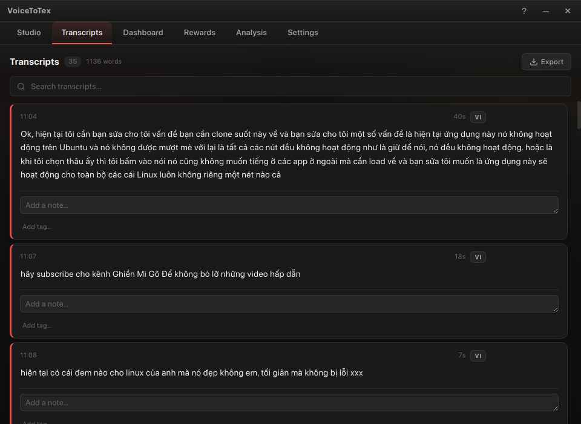
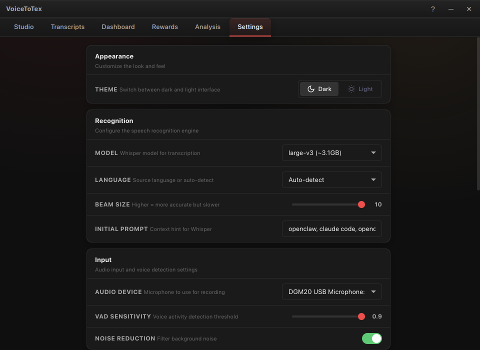
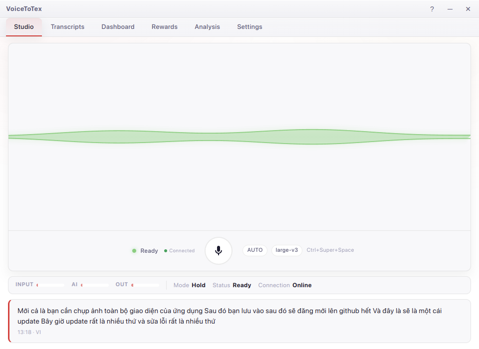
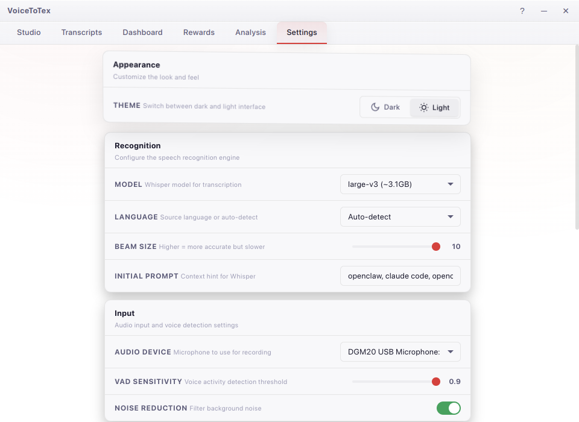

# VoiceToTex

**Local, offline voice-to-text for Linux — powered by Whisper Large V3.**

Press a hotkey, speak, release. Your words appear as text instantly — no cloud, no latency, no subscription.

<p align="center">
  
</p>

---

## Features

- **Fully offline** — Whisper runs locally on your GPU. Nothing leaves your machine.
- **Global hotkey** — Hold `Ctrl+Super+Space` to talk, release to transcribe. Or toggle mode.
- **20+ languages** — Auto-detect or lock to Vietnamese, English, Japanese, and more.
- **Dark & Light themes** — Switch instantly in Settings → Appearance.
- **Real-time waveform** — Live audio visualization while recording.
- **Transcript history** — Search, edit, tag, and export all your transcriptions.
- **Audio ducking** — Automatically mutes other apps while you record.
- **Sound feedback** — Chirps on record start/stop, chime on transcript ready.
- **Floating overlay** — Compact always-on-top indicator during recording.
- **Smart text injection** — Paste, type (xdotool), or copy-to-clipboard output modes.
- **Dashboard & gamification** — Track usage stats and earn milestones.
- **Session analysis** — AI-powered insights on your transcription patterns.

---

## Screenshots

### Dark Theme

<p align="center">
  
  
</p>
<p align="center">
  
  
</p>

### Light Theme

<p align="center">
  
  
</p>

---

## Install

### Pre-built .deb (Ubuntu/Debian)

Download the latest `.deb` from [Releases](https://github.com/riftzen-bit/voicetotex/releases), then:

```bash
sudo dpkg -i voicetotex_1.1.0_amd64.deb
```

### From source

```bash
git clone https://github.com/riftzen-bit/voicetotex.git
cd voicetotex
bash scripts/setup.sh
bash scripts/start.sh
```

#### Manual setup

```bash
python3 -m venv venv && source venv/bin/activate
pip install -r backend/requirements.txt
npm install
npm start
```

---

## Usage

| Shortcut | Action |
|---|---|
| `Ctrl+Super+Space` | Hold to record, release to transcribe |
| Mic button | Click or hold (follows hotkey mode setting) |

**Output modes:** Paste (clipboard → Ctrl+V), Type (xdotool keystrokes), or Copy-only.

---

## Configuration

All settings are in the **Settings** tab:

| Section | Options |
|---|---|
| **Appearance** | Dark / Light theme |
| **Recognition** | Model size, language, beam size, initial prompt |
| **Input** | Audio device, VAD sensitivity, noise reduction |
| **Output** | Output mode (paste/type/copy), hotkey, hotkey mode |
| **Advanced** | WebSocket port, max recording duration |

Config is stored at `~/.config/voicetotex/config.json`.

---

## Tech Stack

| Layer | Technology |
|---|---|
| Desktop shell | Electron 35 |
| Transcription | faster-whisper (CTranslate2) on CUDA/CPU |
| Backend | Python 3.11+ WebSocket server |
| IPC | WebSocket (real-time audio levels + state) |
| Audio | PulseAudio/PipeWire via sounddevice |

---

## Architecture

```
┌─────────────────────────────────────────────┐
│  Electron Main Process                      │
│  ├── BrowserWindow (renderer)               │
│  ├── System Tray                            │
│  └── Floating Overlay                       │
└──────────────┬──────────────────────────────┘
               │ spawns
┌──────────────▼──────────────────────────────┐
│  Python Backend (WebSocket server)          │
│  ├── AudioCapture (sounddevice)             │
│  ├── Transcriber (faster-whisper)           │
│  ├── AudioDucker (pactl)                    │
│  ├── TextInjector (xdotool/xclip/xsel)     │
│  ├── HotkeyListener (pynput)               │
│  └── TranscriptionHistory (JSON)            │
└─────────────────────────────────────────────┘
```

---

## Project Structure

```
voicetotex/
├── electron/          # Main process, preload, tray, overlay
├── src/
│   ├── css/           # Styles (dark/light themes)
│   ├── js/            # App logic, waveform, sounds, websocket
│   └── index.html     # Main renderer
├── backend/           # Python server, transcriber, audio
├── scripts/           # setup.sh, start.sh
├── build/             # Packaging scripts
├── docs/screenshots/  # App screenshots
└── package.json
```

---

## Requirements

- **OS:** Linux (Ubuntu 22.04+ recommended)
- **GPU:** NVIDIA with CUDA support (recommended for real-time transcription)
- **CPU:** Works on CPU too (set device to `cpu` in settings, slower)
- **Python:** 3.11+
- **Node.js:** 18+

---

## License

[MIT](LICENSE)

---

## Acknowledgments

- [OpenAI Whisper](https://github.com/openai/whisper)
- [faster-whisper](https://github.com/SYSTRAN/faster-whisper) / [CTranslate2](https://github.com/OpenNMT/CTranslate2)
- [Electron](https://www.electronjs.org/)
