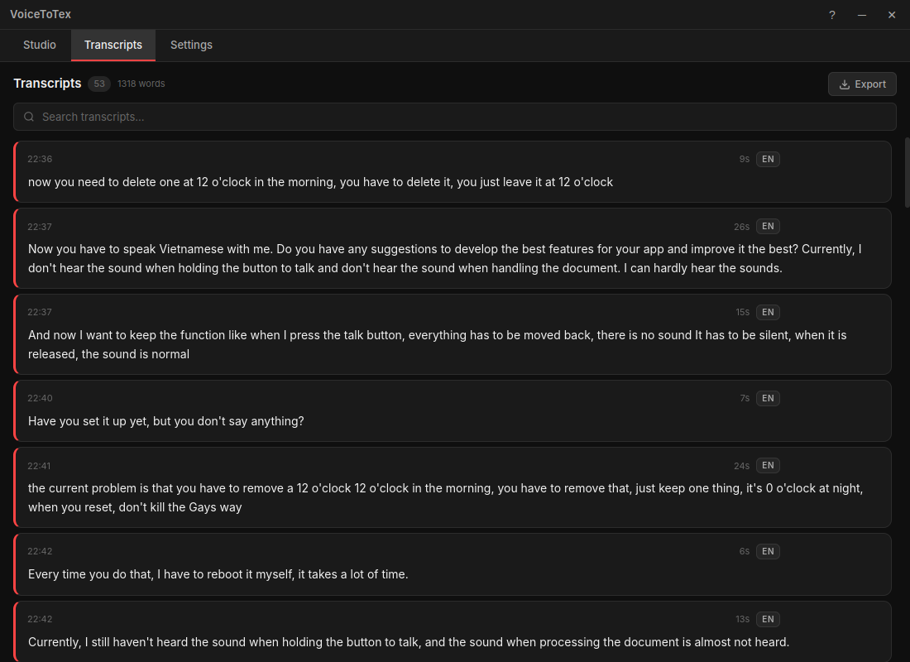

# VoiceToTex: Local Voice-to-Text for Desktop



## Feature highlights

* Local and offline Whisper transcription
* Global hotkey with hold-to-talk and toggle modes
* Floating overlay
* Multi-language support including Vietnamese, English, and 10+ other languages
* Real-time waveform visualization
* Transcript history with search and export
* Audio ducking
* Customizable settings
* System tray integration

## Tech stack

* Electron 35
* Python 3.11+
* faster-whisper (CTranslate2)
* WebSocket IPC

## Prerequisites

* Node.js 18+
* Python 3.11+
* CUDA-compatible GPU (recommended)
* Linux (primary platform)
* pip
* npm

## Quick Start

```bash
git clone https://github.com/riftzen-bit/voicetotex.git
cd voicetotex
bash scripts/setup.sh
bash scripts/start.sh
```

### Manual setup

To set up the environment manually:

1. Create and activate a Python virtual environment:
   ```bash
   python3 -m venv venv
   source venv/bin/activate
   ```
2. Install Python dependencies:
   ```bash
   pip install -r backend/requirements.txt
   ```
3. Install Node.js dependencies:
   ```bash
   npm install
   ```

## Usage

| Shortcut | Action |
| --- | --- |
| Ctrl+Shift+Space | Start/Stop recording (Global hotkey) |
| Ctrl+Shift+V | Paste transcribed text |

The application supports both hold-to-talk and toggle recording modes. You can initiate recording using the global hotkey or the microphone button on the floating overlay. The overlay remains visible during recording to provide visual feedback and waveform visualization.

## Configuration

The settings menu allows for detailed configuration:

* **Model selection:** Choose different Whisper model sizes based on hardware capabilities.
* **Language:** Set the primary language for transcription.
* **VAD threshold:** Adjust Voice Activity Detection sensitivity.
* **Beam size:** Configure the search beam size for transcription accuracy.
* **Output modes:** Choose between paste (clipboard), type (xdotool), or copy-only.
* **Noise reduction:** Enable filters to improve transcription in noisy environments.

## Architecture overview

VoiceToTex uses a decoupled architecture. The Electron main process manages the system tray, application windows, and the floating overlay. A Python backend handles audio processing and Whisper transcription. Communication between the renderer and the Python backend occurs via WebSockets rather than standard Electron IPC to facilitate real-time data streaming.

## Project structure

```
voicetotex/
├── electron/      # Main process (window, tray, overlay)
├── src/           # Renderer (HTML, CSS, JS)
├── backend/       # Python WebSocket server + Whisper
├── scripts/       # Setup & start scripts
└── package.json
```

## Contributing

Please refer to [CONTRIBUTING.md](CONTRIBUTING.md) for guidelines on how to contribute to this project.

## License

This project is licensed under the [MIT License](LICENSE).

## Credits and Acknowledgments

* [OpenAI Whisper](https://github.com/openai/whisper)
* [faster-whisper](https://github.com/SYSTRAN/faster-whisper) / [CTranslate2](https://github.com/OpenNMT/CTranslate2)
* [Electron](https://www.electronjs.org/)
